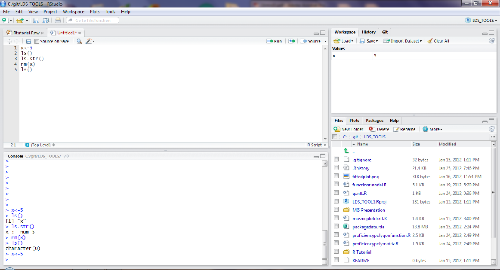
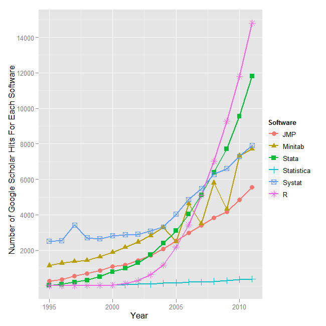
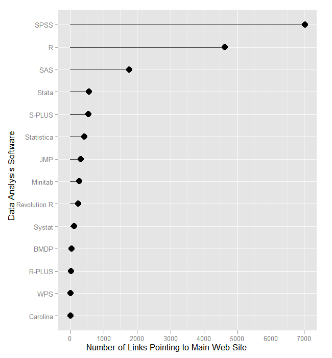
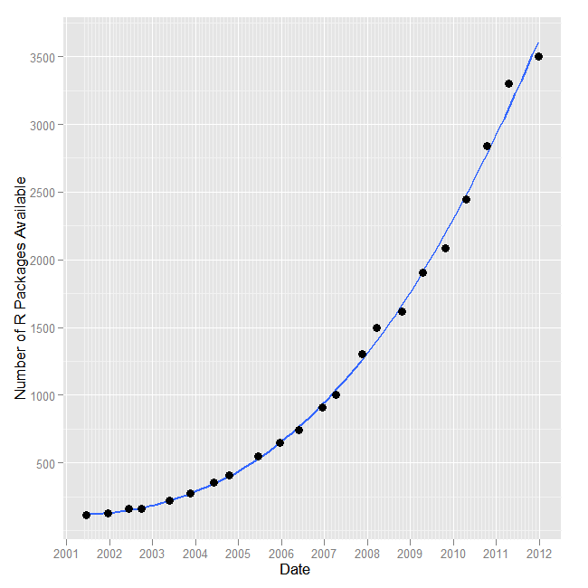
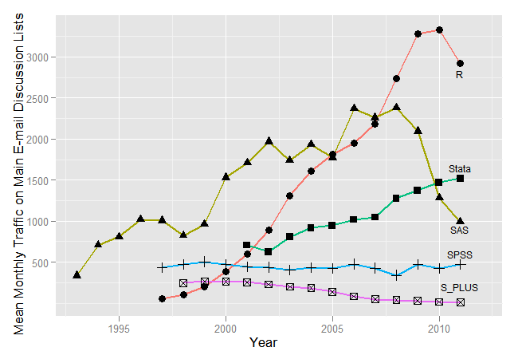

<style>
em {
  font-style: italic
}
strong {
  font-weight: bold;
}
</style>


## Overview
- What is R?
- What is RStudio?
- How does it work?
- What makes the language different?
- Why learn it?
<p align="center"></p>

--- .dark

## R
- R is an Open Source (and freely available) environment for statistical computing and graphics
- Available for Windows, Mac OS X, and Linux
- R is being actively developed with two major releases per year and dozens of releases of add on packages
- R can be extended with 'packages' that contain data, code, and documentation to add new functionality

---

## What Does it Look Like?
The R workspace in RStudio

<p align="center"></p>

---
## A Bit of Histo**R**y
- R is a flavor of the **S** computer language
- S was developed by John Chambers at Bell Labs in the late 1970s
- In 1988 it was rewritten from a Fortran base to a C base
- Version 4 of S, the latest version, was finished in 1998, and won several awards

--- quote
## John Chambers on the Philosophy of S
<p><q>[W]e wanted users to be able to begin in an interactive environment, where they did not consciously think of themselves as <span class = 'red'>programming</span>. Then as their needs became  clearer and their sophistication increased, they should be  able to <span class = 'red'>slide gradually</span> into programming, when the language and system aspects would become more important.</p></q>

---

## R is Born
- 1991 in New Zealand Ross Ihaka and Robert Gentleman create R
- Named for their first initials
- R is made public in 1993, and in 1995 Martin Maechler convinces the creators to make it open source with the GNU General Public License
- 1997 R Core Group is formed--the maintainers and main developers of R (about 14 members today)
- 2000 version 1.0.0 ships
- 2012 version 2.15.2 is available (2.16.0 is due out early in 2013)

---

## Why Use R
- R is a common tool among data experts at major universities
- No need to go through procurement, R can be installed in any environment on any machine and used with no licensing or agreements needed
- R source code is very readable to increase transparency of processes
- R code is easily borrowed from and shared with others
- R is incredibly flexible and can be adapted to specific local needs
- R is under incredibly active development, improving greatly, and supported wildly by both professional and academic developers

---

## Thoughts on Free
- R is free in many senses
  1. R can be run and used for any purpose, commercial or non-commercial, profit or not-for-profit
  2. R's source code is freely available so you can study how it works and adapt it to your needs.
  3. R is free to redistribute so you can share it with your ~~enemies~~  friends
  4. R is free to modify and those modifications are free to redistribute and may be adopted by the rest of the community!

---

## R Advantages Continued
- R is platform agnostic - Linux, Mac, PC, server, desktop, etc.
- R can output results in a variety of formats
- R can build routines straight out of a database for common and universal reporting

### R Can Compliment Other Tools

- R plays nicely with data from Stata, SPSS, SAS and others
- R can check work, produce output, visualize results from other programs
- R can do bleeding edge analyses that aren't available in proprietary packages yet
- R is becoming more prevalent in undergraduate statistics courses - more and more potential employees are learning it each year

---

## R's Popularity
R has recently passed Stata on Google Scholar hits and it is catching up to the two major players SPSS and SAS

<p align="center"></p>

---

## R Has an Active Web Presence
R is linked to from more and more sites 

<p align="center"></p>

---

## R Extensions
These links come from the explosion of add-on packages to R

<p align="center"></p>

---

## R Has an Active Community 
Usage of the R listserv for help has really exploded recently

<p align="center"></p>

Data from Bob Muenchen [available online](http://r4stats.com/articles/popularity/)

---

## R's Drawbacks
- R is based on S, which is close to 40 years old
- R only has features that the community contributes
- Not the ideal solution to all problems
- R is a programming language and not a software package--steeper learning curve
- R can be much slower than compiled languages

---

## R Vocabulary
- **packages** are add on features to R that include data, new functions and methods, and extended capabilities. Think of them as ``apps'' on your phone. We've already installed several!
- **terminal** this is the main window of R where you enter commands
- **scripts** these are where you store commands to be run in the terminal later, like syntax files in SPSS or .do files in Stata
- **functions** commands that do something to an object in R
- **dataframe** the main element for statistical purposes, an object with rows and columns that includes numbers, factors, and other data types
- **workspace** the working memory of R where all objects are stored
- **vector** the basic unit of data in R
- **symbols** used to name and store objects or to designate operations/functions
- **attributes** determine how functions act on objects

---

## Components of an R Setup
- **R** - R works in the command line of any OS, but also comes with a basic GUI to operate on its own in Windows and Mac [download](http://cran.r-project.org/)
- **RStudio** - a much better way to work in R that allows editing of scripts, operation of R, viewing of the workspace, and R help all on one screen [download](http://rstudio.org/download/)
- We've already installed and configured these, but what might you want to use to go further after the Bootcamp is complete?

---

## Advanced R Setup
- **LaTeX** - for producing documents using R this is less necessary, but still useful. download [WIN](http://miktex.org/2.9/setup) [MAC](http://www.tug.org/mactex/2011/)
- **Dev Tools for R** - on Windows this is Rtools, on Linux and Mac it is installing the development mode of R download [WIN](http://www.stats.ox.ac.uk/pub/Rtools/R215x.html) [MAC](http://cran.r-project.org/bin/macosx/tools/)
- **Git** - for version control, sharing code, and collaboration this is essential. It integrates well with RStudio. [download](http://git-scm.com/download)
- **pandoc** - for converting output into other formats for sharing with non-user**R**s! [download](http://johnmacfarlane.net/pandoc/installing.html)
- **ImageMagick** - for creating more flexible graphics in R, including animations! [download](http://www.imagemagick.org/script/index.php) [alternate](http://www.graphicsmagick.org/)

---

## Open Source Toolchain
- This really represents a completely open source toolchain to going from a data analysis idea, to a full fledged professional report
- These tools are free, updated regularly, and available on **any** platform **today**
- This toolchain is scriptable, reproducible, and has been around for quite some time so it is stable and robust
- Lots of other programming languages use aspects of this toolchain

---

## Some Notes about Maintaining R
- Adding packages onto R means you also have to update them with the `update.packages()` command
- Package updates are at the whim of the package developer which may be a corporation, an R Core Member, an academic, or me
- Upgrading R on Windows, which is on a 6 month release cycle, is not straightforward yet, but there are lots of how-to guides online
- Generally, upgrading is recommended as there are usually a lot of performance enhancements, even with minor (2.15.X) releases
- We will walk through this a bit later, but remember that the flexibility in R means that users probably need to be self-supported in your organization

---

## Self-help
- In the spirit of open-source R is very much a self-guided tool
- Let's see, type: `?summary`
- Now type: `??regression`
- For tricky questions, funky error messages (there are many), and other issues, use Google (include "in R" to the end of your query)
- We can also use [RSeek](http://www.rseek.org/) - the search engine just for R!
- StackOverflow has become a great resource with many questions for many specific packages in R, and a rating system for answers
- A number of R Core members contribute there

---

## Self-help (2)
- Sometimes R Help can be a bit prickly and unfriendly...
- The most important part of getting help is being able to ask your question with a reproducible example (i.e. some short simulated data and code that doesn't do what you want)
- Like this:


```r
foo <- c(1, "b", 5, 7, 0)
bar <- c(1, 2, 3, 4, 5)
foo + bar
```

```
Error: non-numeric argument to binary operator
```


- For R Help etiquette (for the tough problems) see [the great advice here](https://github.com/hadley/devtools/wiki/Reproducibility)

---

## Let's Look at RStudio
- RStudio has made R more accessible and easy to use than ever!
- Open up **Tutorial1.R**
- 4 panels, various tabs
- Help, plots, file structure
- Workspace, history, version control
- Working files
- The R Console

---

## The Data Frame
- What happens when you type:


```r
data(mtcars)
mtcars
```


                   mpg cyl  disp  hp drat    wt  qsec vs am gear carb
Mazda RX4         21.0   6 160.0 110 3.90 2.620 16.46  0  1    4    4
Mazda RX4 Wag     21.0   6 160.0 110 3.90 2.875 17.02  0  1    4    4
Datsun 710        22.8   4 108.0  93 3.85 2.320 18.61  1  1    4    1
Hornet 4 Drive    21.4   6 258.0 110 3.08 3.215 19.44  1  0    3    1
Hornet Sportabout 18.7   8 360.0 175 3.15 3.440 17.02  0  0    3    2
Valiant           18.1   6 225.0 105 2.76 3.460 20.22  1  0    3    1
Duster 360        14.3   8 360.0 245 3.21 3.570 15.84  0  0    3    4
Merc 240D         24.4   4 146.7  62 3.69 3.190 20.00  1  0    4    2


- This is how we'll look at R commands and their results the rest of the way

---

## A Data Frame
- A data frame is a lot like a traditional spreadsheet and is the central feature of data analysis in R
- You'll see we have names, stored with numbers, which other programming languages are not so keen on doing
- This is really handy, and data frames are the primary method we use to store data, manipulate data, etc.
- The difference between a data frame and spreadsheet in Excel is that in almost all cases, everything we do to the data frame will either be by entire row, or by entire column
- This sounds limiting, but in fact, it is incredibly powerful!

---

## R As A Calculator


```r
2 + 2  ## add numbers
```

```
[1] 4
```

```r
2 * pi  #multiply by a constant
```

```
[1] 6.283
```

```r
7 + runif(1, min = 0, max = 1)  #add a random variable
```

```
[1] 7.005
```

```r
4^4  # powers
```

```
[1] 256
```

```r
sqrt(4^4)  # functions
```

```
[1] 16
```


---

## Arithmetic Operators
- In addition to the obvious `+` `-` `=` `/` `*` and exponential `^`, there is also integer division `%/%` and remainder in integer division (known as modulo arithmetic) `%%`

```r
2 + 2
```

```
[1] 4
```

```r
2/2
```

```
[1] 1
```

```r
2 * 2
```

```
[1] 4
```

```r
2^2
```

```
[1] 4
```

```r
2 == 2
```

```
[1] TRUE
```

```r
23%/%2
```

```
[1] 11
```

```r
23%%2
```

```
[1] 1
```


---

## Other Key Symbols
- `<-` is the assignment operator, it declares something is something else

```r
foo <- 3
foo
```

```
[1] 3
```

- `:` is the sequence operator

```r
1:10
```

```
 [1]  1  2  3  4  5  6  7  8  9 10
```

```r
# it increments by one
a <- 100:120
a
```

```
 [1] 100 101 102 103 104 105 106 107 108 109 110 111 112 113 114 115 116
[18] 117 118 119 120
```

- **This is handy**

---

## Comments in R
- **#** denotes a comment in R
- Anything after the **#** is not evaluated and ignored in R
- This is handy for making things reproducible


```r
# Something I want to keep from R
# Like my secret from the R engine
# Maybe intended for a human and not the computer
# Like: Look at this cool plot!

myplot(readSS,mathSS,data=df)
```


---

## R Advanced Math
- R also supports advanced mathematical features and expressions
- R can take integrals and derivatives and express complex functions
- Easiest of all, R can generate distributions of data very easily

  - e.g. `rnorm(100)` or `rbinom(100)`

- This comes in handy when writing examples and building analyses because it is trivial to generate a synthetic piece of data to use as an example
- Go ahead, try typing `hist(rnorm(10000))` into RStudio

---

## Using the Workspace
- To do more we need to learn how to manipulate the 'workspace'.
- This includes all the vectors, datasets, and functions stored in memory.
- All R objects are stored in the memory of the computer, limiting the available space for calculation to the size of the RAM on your machine.
- R makes organizing the workspace easy.

---

## Using the Workspace (2)

```r
x <- 5  #store a variable with <-
x  #print the variable
```

```
[1] 5
```

```r
z <- 3
ls()  #list all variables
```

```
 [1] "a"          "bar"        "foo"        "inputFile"  "knit_deck" 
 [6] "mtcars"     "outputFile" "postFile"   "x"          "z"         
```

```r
ls.str()  #list and describe variables
```

```
a :  int [1:21] 100 101 102 103 104 105 106 107 108 109 ...
bar :  num [1:5] 1 2 3 4 5
foo :  num 3
inputFile :  chr "Tutorial1_Intro.Rmd"
knit_deck :  logi TRUE
mtcars : 'data.frame':	32 obs. of  11 variables:
 $ mpg : num  21 21 22.8 21.4 18.7 18.1 14.3 24.4 22.8 19.2 ...
 $ cyl : num  6 6 4 6 8 6 8 4 4 6 ...
 $ disp: num  160 160 108 258 360 ...
 $ hp  : num  110 110 93 110 175 105 245 62 95 123 ...
 $ drat: num  3.9 3.9 3.85 3.08 3.15 2.76 3.21 3.69 3.92 3.92 ...
 $ wt  : num  2.62 2.88 2.32 3.21 3.44 ...
 $ qsec: num  16.5 17 18.6 19.4 17 ...
 $ vs  : num  0 0 1 1 0 1 0 1 1 1 ...
 $ am  : num  1 1 1 0 0 0 0 0 0 0 ...
 $ gear: num  4 4 4 3 3 3 3 4 4 4 ...
 $ carb: num  4 4 1 1 2 1 4 2 2 4 ...
outputFile :  chr "Tutorial1_Intro.md"
postFile :  chr "Tutorial1_Intro.Rmd"
x :  num 5
z :  num 3
```

```r
rm(x)  # delete a variable
ls()
```

```
[1] "a"          "bar"        "foo"        "inputFile"  "knit_deck" 
[6] "mtcars"     "outputFile" "postFile"   "z"         
```


---

## R as a Language
- R is more than statistical software, it is a computer language
- Like any language it has rules (some poorly enforced), and conventions
- You will learn more as you go, but we'll go over a few to start

1. Case sensitivity matters

```r
a <- 3
A <- 4
print(c(a, A))
```

```
[1] 3 4
```

  * <font color="red">**a** &#8800; **A**</font> 
2. What happens if I type **print(a,A)**?

---

## `c` is our friend
- So what does **c** do?

```r
A <- c(3, 4)
print(A)
```

```
[1] 3 4
```

- `c` stands for concatenate and allows vectors to have multiple elements
- If you ever need two elements in a vector, you need to wrap it up in `c`, which is one of the most used functions you will ever use
- `c` is important to put any vector together, but remember that objects within a vector must all be of the same type

---

## Language
- In language there are a number of ways to say the same thing
  *  <font color="green">The dog chased the cat.</font> 
  *  <font color ="blue">The cat was chased by the dog.</font>
  *  <font color ="red">By the dog, the cat was chased.</font>
- Some ways are more elegant than others, all convey the same message. 

```r
a <- runif(100)  # Generate 100 random numbers
b <- runif(100)  # 100 more
c <- NULL  # Setup for loop (declare variables)
for (i in 1:100) {
    # Loop just like in Java or C
    c[i] <- a[i] * b[i]
}
d <- a * b
identical(c, d)  # Test equality
```

```
[1] TRUE
```

- Which is nicer? **c** or **d**?

---
## More Language ~~Bugs~~ Features
- R is maddeningly inconsistent in it's naming conventions
  * Some functions are `camelCase`; others `are.dot.separated`; others `use_underscores`
  * Function results are stored in a variety of ways across function implementations
  * R has multiple graphics packages that different functions use for default plot construction (`base`, `grid`, `lattice`, and `ggplot2`)
  * R has multiple packages and functions to do the same analysis as well, though some standardization has started to occur
  * Be flexible and be aware of R's flexibility
  


```
Warning: cannot open compressed file 'data/smalldata.rda', probable reason
'No such file or directory'
```

```
Error: cannot open the connection
```

---
## Objects
- Everything in R is an object - even functions
- Objects can be manipulated many ways
- A common example is applying the `summary` function to a variety of object types and seeing how it adapts

```r
summary(df[, 28:31])  #summary look at df object
```

```
Error: object of type 'closure' is not subsettable
```

```r
summary(df$readSS)  #summary of a single column
```

```
Error: object of type 'closure' is not subsettable
```

-The `$` says to look for object **readSS** in object **df**

---

## Graphics too


```r
library(ggplot2) # Load graphics Package
library(eeptools)
qplot(readSS,mathSS,data=df,geom='point',alpha=I(0.3))+theme_dpi()+
  opts(title='Test Score Relationship')+
  geom_smooth()
```

```
Error: ggplot2 doesn't know how to deal with data of class function
```


---

## Handling Data in R
- R handles data differently than many other statistical packages
- In R, all elements are objects

```r
length(unique(df$school))
```

```
Error: object of type 'closure' is not subsettable
```

```r
length(unique(df$stuid))
```

```
Error: object of type 'closure' is not subsettable
```

```r
uniqstu <- length(unique(df$stuid))
```

```
Error: object of type 'closure' is not subsettable
```

```r
uniqstu
```

```
Error: object 'uniqstu' not found
```

- Results of function calls can be stored

---

## Special Operators
- The comparison operators `<`, `>`, `<=`, `>=`, `==`, and `!=` are used to compare values across vectors

```r
big <- c(9, 12, 15, 25)
small <- c(9, 3, 4, 2)
# Give us a nice vector of logical values
big > small
```

```
[1] FALSE  TRUE  TRUE  TRUE
```

```r
big = small
# Oops--don't do this, reassigns big to small
print(big)
```

```
[1] 9 3 4 2
```

```r
print(small)
```

```
[1] 9 3 4 2
```

- Comparison operators can be tricky, so to keep it straight never use `=` or `==` to assign anything, always use `<-`

---

## Special Operators II
- The best way to evaluate these objects is to use brackets `[]` to avoid confusion


```r
big <- c(9, 12, 15, 25)
big[big == small]
```

```
[1] 9
```

```r
# Returns values where the logical vector is true
big[big > small]
```

```
[1] 12 15 25
```

```r
big[big < small]  # Returns an empty set
```

```
numeric(0)
```


---

## Special operators (III)
- The `%in%` operator determines whether each value in the left operand can be matched with one of the values in the right operand.

```r
big <- c(9, 12, 15, 25)
small <- c(9, 12, 15, 25, 9, 1, 3)
big[small %in% big]
```

```
[1]  9 12 15 25 NA
```

- 9, 12, 15, and 25 all appear in `big`, but `small` also has objects that do not appear in `big` and so an NA is returned
- What if we reverse this?

```r
big[big %in% small]
```

```
[1]  9 12 15 25
```

- No `NA`

---

## Special operators (IV)
- The logical operators `|` (or) and `&` (and) can be used to combine two logical values and produce another logical value as the result. The operator `!` (not) negates a logical value. These operators allow complex conditions to be constructed.

```r
foo <- c("a", NA, 4, 9, 8.7)
!is.na(foo)  # Returns TRUE for non-NA
```

```
[1]  TRUE FALSE  TRUE  TRUE  TRUE
```

```r
class(foo)
```

```
[1] "character"
```

```r
a <- foo[!is.na(foo)]
a
```

```
[1] "a"   "4"   "9"   "8.7"
```

```r
class(a)
```

```
[1] "character"
```


---

## Special operators (V)
- The operators `||` and `&&` are similar, but they combine two logical vectors. The comparison is performed element by element, so the result is also a logical vector.


```r
zap <- c(1, 4, 8, 2, 9, 11)
zap[zap > 2 | zap < 8]
```

```
[1]  1  4  8  2  9 11
```

```r
zap[zap > 2 & zap < 8]
```

```
[1] 4
```


---

## Regular Expressions
- R also supports a full suite of regular expressions
- This could be material for a full tutorial in a more advanced bootcamp
- If you know and use regex, then rest assured you can keep using it in R

---

## R Data Modes
- R allows users to implement a number of different types of data
- The three basic data types are numeric data, character data, and logical data
- Vectors must be of one consistent type of data, so if you make a vector with multiple types, it generally defaults to being a character vector

---

## Data Modes in R (numeric)
- **numeric** vectors contain, as you would guess, numbers!


```r
is.numeric(A)
```

```
[1] TRUE
```

```r
class(A)
```

```
[1] "numeric"
```

```r
print(A)
```

```
[1] 3 4
```


---

## Data Modes (Character)
- **character** is known as strings in other software, any characters that have no numeric meaning


```r
b <- c("one", "two", "three")
print(b)
```

```
[1] "one"   "two"   "three"
```

```r
is.numeric(b)
```

```
[1] FALSE
```


---

## Data Modes (Logical)
- **logical** is TRUE or FALSE values, useful for logical testing and programming
- We've already seen these returned when we have asked R a question before


```r
c <- c(TRUE, TRUE, TRUE, FALSE, FALSE, TRUE)
is.numeric(c)
```

```
[1] FALSE
```

```r
is.character(c)
```

```
[1] FALSE
```

```r
is.logical(c)  ## Results in a logical value
```

```
[1] TRUE
```


---

## Easier way
- Just ask R using the `class` function


```r
class(A)
```

```
[1] "numeric"
```

```r
class(b)
```

```
[1] "character"
```

```r
class(c)
```

```
[1] "logical"
```


---

## A Note on Vectors
- Vectors are collections of consistent data types
- **numeric** can either be double or integer depending on the *bytes* size
- **logical**
- **character**
- **complex**
- **raw**
- All vectors must be consistent among types, but some data objects like data frames can combine multiple vectors of different types

---

## Factor
- A factor is a very special and sometimes frustrating data type in R


```r
myfac <- factor(c("basic", "proficient", "advanced", "minimal"))
class(myfac)
```

```
[1] "factor"
```

```r
myfac  # What order are the factors in?
```

```
[1] basic      proficient advanced   minimal   
Levels: advanced basic minimal proficient
```

- What if we don't like the order these are in? Factor order is important for all kinds of things like plot type, regression output, and more

---

## Ordering the Factor
- Ordered factors simply have an additional attribute explaining the order of the levels of a factor
- This is a useful shortcut when we want to preserve some of the meaning provided by the order
- Think cardinal data


```r
myfac_o <- ordered(myfac, levels = c("minimal", "basic", "proficient", "advanced"))
myfac_o
```

```
[1] basic      proficient advanced   minimal   
Levels: minimal < basic < proficient < advanced
```

```r
summary(myfac_o)
```

```
   minimal      basic proficient   advanced 
         1          1          1          1 
```


---

## Reclassifying Factors
- Turning factors into other data types can be tricky. All factor levels have an underlying numeric structure.


```r
class(myfac_o)
```

```
[1] "ordered" "factor" 
```

```r
unclass(myfac_o)
```

```
[1] 2 3 4 1
attr(,"levels")
[1] "minimal"    "basic"      "proficient" "advanced"  
```

```r
defac <- unclass(myfac_o)
defac
```

```
[1] 2 3 4 1
attr(,"levels")
[1] "minimal"    "basic"      "proficient" "advanced"  
```


- What is wrong with this? Well--why would `minimal` be `2` and `basic` be `3`?
- Be careful! The best way to unpack a factor is to convert it to a character first.

---

## Defactor

```r
# From the eeptools package
defac <- function(x) {
    x <- as.character(x)
    x
}
```


```r
defac(myfac_o)
```

```
[1] "basic"      "proficient" "advanced"   "minimal"   
```

```r
defac <- defac(myfac_o)
defac
```

```
[1] "basic"      "proficient" "advanced"   "minimal"   
```


---

## Convert to Numeric?
- What if we do want it to be numeric?
- The best way to do this is to recode the variable manually--we'll discuss this later
- You can try to convert it to numeric though, but do at your own risk:


```r
myfac_o
```

```
[1] basic      proficient advanced   minimal   
Levels: minimal < basic < proficient < advanced
```

```r
as.numeric(myfac_o)
```

```
[1] 2 3 4 1
```

- If we did not properly specify the order above, this would be wrong!


```r
myfac
```

```
[1] basic      proficient advanced   minimal   
Levels: advanced basic minimal proficient
```

```r
as.numeric(myfac)
```

```
[1] 2 4 1 3
```


---

## Dates
- R has built-in ways to handle dates
- See `lubridate` package for more advanced functionality including mathematical operations on dates


```r
mydate <- as.Date("7/20/2012", format = "%m/%d/%Y")
# Input is a character string and a parser
class(mydate)  # this is date
```

```
[1] "Date"
```

```r
weekdays(mydate)  # what day of the week is it?
```

```
[1] "Friday"
```

```r
mydate + 30  # Operate on dates
```

```
[1] "2012-08-19"
```


---

## More Dates


```r
# We can parse other formats of dates
mydate2 <- as.Date("8-5-1988", format = "%d-%m-%Y")
mydate2
```

```
[1] "1988-05-08"
```

```r

mydate - mydate2
```

```
Time difference of 8839 days
```

```r
# Can add and subtract two date objects
```


---

## A few notes on dates
- R converts all dates to numeric values, like Excel and other languages
- The origin date in R is January 1, 1970


```r
as.numeric(mydate)  # days since 1-1-1970
```

```
[1] 15541
```

```r
as.Date(56, origin = "2013-4-29")  # we can set our own origin
```

```
[1] "2013-06-24"
```


---

## Other Classes
- R classes can be specified for any special purpose
- Like linear models


```r
b <- rnorm(5000)
c <- runif(5000)
a <- b + c
mymod <- lm(a ~ b)
class(mymod)
```

```
[1] "lm"
```


---

## Why care so much about classes?
- Classes determine what you can and can't do with objects
- Different classes have different computational times associated with them, so the choice can affect the optimization of the code
- Classes allow you to keep projects/data organized
- **Because R makes you care**

---

## Data Structures in R
- R has a number of basic data classes as well as arbitrary specialized object types for various purposes
- **vectors** are the basic data class in R and can be thought of as a single column of data (even a column of length 1)
- **matrices and arrays** are rows and columns of all the same mode data
- **dataframes** are rows and columns where the columns can represent different data types
- **lists** are arbitrary combinations of disparate object types in R

---

## Vectors 
- Everything is a vector in R, even single numbers
- Single objects are "atomic" vectors


```r
print(1)
```

```
[1] 1
```

```r
# The 1 in braces means this element is a vector of length 1
print("This tutorial is awesome")
```

```
[1] "This tutorial is awesome"
```

```r
# This is a vector of length 1 consisting of a single 'string of
# characters'
```


---

## Vectors 2

```r
print(LETTERS)
```

```
 [1] "A" "B" "C" "D" "E" "F" "G" "H" "I" "J" "K" "L" "M" "N" "O" "P" "Q"
[18] "R" "S" "T" "U" "V" "W" "X" "Y" "Z"
```

```r
# This vector has 26 character elements
print(LETTERS[6])
```

```
[1] "F"
```

```r
# The sixth element of this vector has length 1
length(LETTERS[6])
```

```
[1] 1
```

```r
# The length of that element is a number with length 1
```


---

## Matrices
- Matrices are combinations of vectors of the same length and data type
- We can have numeric matrices, character matrices, or logical matrices
- Can't mix types


```r
mymat <- matrix(1:36, nrow = 6, ncol = 6)
rownames(mymat) <- LETTERS[1:6]
colnames(mymat) <- LETTERS[7:12]
class(mymat)
```

```
[1] "matrix"
```


---

## Matrices II


```r
rownames(mymat)
```

```
[1] "A" "B" "C" "D" "E" "F"
```

```r
colnames(mymat)
```

```
[1] "G" "H" "I" "J" "K" "L"
```

```r
mymat
```

```
  G  H  I  J  K  L
A 1  7 13 19 25 31
B 2  8 14 20 26 32
C 3  9 15 21 27 33
D 4 10 16 22 28 34
E 5 11 17 23 29 35
F 6 12 18 24 30 36
```


---

## More Matrices
- We can add to matrices


```r
dim(mymat)  # We have 6 rows and 6 columns
```

```
[1] 6 6
```

```r
myvec <- c(5, 3, 5, 6, 1, 2)
length(myvec)  # What happens when you do dim(myvec)?
```

```
[1] 6
```

```r
newmat <- cbind(mymat, myvec)
newmat
```

```
  G  H  I  J  K  L myvec
A 1  7 13 19 25 31     5
B 2  8 14 20 26 32     3
C 3  9 15 21 27 33     5
D 4 10 16 22 28 34     6
E 5 11 17 23 29 35     1
F 6 12 18 24 30 36     2
```

- Dataframes work similarly

---

## Matrix Functions
- We can do some basic math to matrices as well, like correlations


```r
foo.mat <- matrix(c(rnorm(100), runif(100), runif(100), rpois(100, 2)), ncol = 4)
head(foo.mat)
```

```
        [,1]     [,2]    [,3] [,4]
[1,] -0.1455 0.946583 0.67718    4
[2,]  0.3746 0.286182 0.51514    3
[3,]  0.1324 0.877679 0.06144    2
[4,]  0.6075 0.661667 0.13387    0
[5,]  0.5147 0.259139 0.90112    3
[6,]  0.2519 0.007189 0.79541    1
```

```r
cor(foo.mat)
```

```
         [,1]     [,2]     [,3]     [,4]
[1,]  1.00000 -0.13128  0.04215 -0.11503
[2,] -0.13128  1.00000 -0.06346 -0.07017
[3,]  0.04215 -0.06346  1.00000  0.04977
[4,] -0.11503 -0.07017  0.04977  1.00000
```


- The result is a matrix itself, but we can force it to be something else

---

## Converting Matrices
- Let's make a matrix be a dataframe

```r
mycorr <- cor(foo.mat)
class(mycorr)
```

```
[1] "matrix"
```

```r
mycorr2 <- as.data.frame(mycorr)
class(mycorr2)
```

```
[1] "data.frame"
```

```r
mycorr2
```

```
        V1       V2       V3       V4
1  1.00000 -0.13128  0.04215 -0.11503
2 -0.13128  1.00000 -0.06346 -0.07017
3  0.04215 -0.06346  1.00000  0.04977
4 -0.11503 -0.07017  0.04977  1.00000
```


---

## Arrays
- Arrays are a set of matrices of the same `dim` and `class`
- Arrays allow dimensions to be named


```r
myarray <- array(1:42, dim = c(7, 3, 2), dimnames = list(c("tiny", "small", 
    "medium", "medium-ish", "large", "big", "huge"), c("slow", "moderate", "fast"), 
    c("boring", "fun")))
class(myarray)
```

```
[1] "array"
```

```r
dim(myarray)
```

```
[1] 7 3 2
```


---

## Arrays II


```r
dimnames(myarray)
```

```
[[1]]
[1] "tiny"       "small"      "medium"     "medium-ish" "large"     
[6] "big"        "huge"      

[[2]]
[1] "slow"     "moderate" "fast"    

[[3]]
[1] "boring" "fun"   
```

```r
myarray
```

```
, , boring

           slow moderate fast
tiny          1        8   15
small         2        9   16
medium        3       10   17
medium-ish    4       11   18
large         5       12   19
big           6       13   20
huge          7       14   21

, , fun

           slow moderate fast
tiny         22       29   36
small        23       30   37
medium       24       31   38
medium-ish   25       32   39
large        26       33   40
big          27       34   41
huge         28       35   42
```


---

## Lists
- Lists are arbitrary collections of objects. 
- The objects do not have to be of the same type or same element or same dimensions


```r
mylist <- list(vec = myvec, mat = mymat, arr = myarray, date = mydate)
class(mylist)
```

```
[1] "list"
```

```r
length(mylist)
```

```
[1] 4
```

```r
names(mylist)
```

```
[1] "vec"  "mat"  "arr"  "date"
```


---

## Print a List

```r
str(mylist)
```

```
List of 4
 $ vec : num [1:6] 5 3 5 6 1 2
 $ mat : int [1:6, 1:6] 1 2 3 4 5 6 7 8 9 10 ...
  ..- attr(*, "dimnames")=List of 2
  .. ..$ : chr [1:6] "A" "B" "C" "D" ...
  .. ..$ : chr [1:6] "G" "H" "I" "J" ...
 $ arr : int [1:7, 1:3, 1:2] 1 2 3 4 5 6 7 8 9 10 ...
  ..- attr(*, "dimnames")=List of 3
  .. ..$ : chr [1:7] "tiny" "small" "medium" "medium-ish" ...
  .. ..$ : chr [1:3] "slow" "moderate" "fast"
  .. ..$ : chr [1:2] "boring" "fun"
 $ date: Date[1:1], format: "2012-07-20"
```


---

## Lists (II)
- R has two object classification schemes S3 and S4
  - For S3 use `$` or `[[]]` to extract elements
  - For S4 use `@` to extract elements


```r
mylist$vec
```

```
[1] 5 3 5 6 1 2
```

```r
mylist[[2]][1, 3]
```

```
[1] 13
```


- Where are we getting the object in the second row from?

---

## So what?
- Matrices, lists, and arrays are useful for storing analyses results, generating reports, and doing analysis on many objects types
- We'll see examples of list and array manipulation later
- A useful tip is to use the `attributes` function to learn about the object


```r
attributes(mylist)
```

```
$names
[1] "vec"  "mat"  "arr"  "date"
```

```r
attributes(myarray)[1:2][2]
```

```
$dimnames
$dimnames[[1]]
[1] "tiny"       "small"      "medium"     "medium-ish" "large"     
[6] "big"        "huge"      

$dimnames[[2]]
[1] "slow"     "moderate" "fast"    

$dimnames[[3]]
[1] "boring" "fun"   
```


- They also provide simplified ways to get used to operating on dataframes by reducing complexity

---

## Dataframes
- Dataframes are combinations of vectors of the same length, but can be of different types


```r
str(df[, 25:32])
```

```
Error: object of type 'closure' is not subsettable
```


- Data frames must have consistent dimensions
- Dataframes are what we use most commonly as a "dataset" for analysis
- Dataframes are what sets R apart from other programming languages like C, C++, Python, and Perl. 
- The dataframe structure is much more complex and much easier to use than any datastructure in these languages - though Python is catching up!

---

## Converting Between Types
- R has built in functions to allow you to force objects to move between types
- These follow the general form `as.whatIwant` as in `as.factor` or `as.table` or `as.data.frame`
- You will use these commands a lot to convert output from various functions into a form you can input into a different function
- A good example is converting correlation matrices into dataframes so we can plot them

---

## Summing it Up
- Vectors are used to store bits of data
- Matrices are combinations of vectors of the same length and type
- Matrices are most commonly used in statistical models (in the background), and for computation
- Arrays are stacks of matrices and are used in building multiple models or for storing complex data structures
- Lists are groups of R objects commonly used to combine function output in useful ways (like store model results and model data together)


---

## Exercises

1. Create a matrix of 5x6 dimensions. Add a vector to it (as either a row or column). Identify element 2,3. 

2. Convert the matrix to a data frame.

3. Look at the difference between data frames and matrices.

---

## Other References
- [An R Vocabulary for Starting Out](https://github.com/hadley/devtools/wiki/vocabulary)
- [UCLA Academic Technology Services: R Starter Kit](http://www.ats.ucla.edu/stat/r/sk/)
- [Quick R: Getting Started](http://www.statmethods.net/)
- [R Features List](http://www.revolutionanalytics.com/what-is-open-source-r/r-language-features/)
- [Video Tutorials](http://www.twotorials.com/)
- [Google's R Style Guide](http://google-styleguide.googlecode.com/svn/trunk/google-r-style.html)
- [Hadley Wickham's R Style Guide](https://github.com/hadley/devtools/wiki/Style)
- [JSM 2012 R Introduction by Jay Emerson](http://www.stat.yale.edu/~jay/JSM2012/PDFs/intro.pdf)
- [Notes on R for Programmers by John Cook](http://www.johndcook.com/R_language_for_programmers.html)

---

## Books
- There are a number of great R books available for learning the beginnings of R and for learning specific statistical techniques
- "Discovering Statistics Using R" by Andy Field
- "Applied Econometrics with R" by Achim Zeileis and Christian Kleiber
- "The Art of R Programming" by Norman Matloff
- [The R Inferno](http://www.burns-stat.com/pages/Tutor/R_inferno.pdf)
- The R Book by Michael J. Crawley (new version imminent)
- The R Cookbook

---

## Session Info

It is good to include the session info, e.g. this document is produced with **knitr** version 1.2.9. Here is my session info:


```r
print(sessionInfo(), locale = FALSE)
```

```
R version 2.15.2 (2012-10-26)
Platform: i386-w64-mingw32/i386 (32-bit)

attached base packages:
[1] stats     graphics  grDevices utils     datasets  methods   base     

other attached packages:
[1] eeptools_0.2    ggplot2_0.9.3.1 slidify_0.3.51 

loaded via a namespace (and not attached):
 [1] codetools_0.2-8    colorspace_1.2-2   dichromat_2.0-0   
 [4] digest_0.6.3       evaluate_0.4.3     formatR_0.7       
 [7] grid_2.15.2        gtable_0.1.2       knitr_1.2.9       
[10] labeling_0.1       markdown_0.5.5     MASS_7.3-23       
[13] munsell_0.4        plyr_1.8           proto_0.3-10      
[16] RColorBrewer_1.0-5 reshape2_1.2.2     scales_0.2.3      
[19] stringr_0.6.2      tools_2.15.1       whisker_0.3-2     
[22] yaml_2.1.7        
```


---

## Attribution and License
This work (<span property="dct:title">R Tutorial for Education</span>, by <a href="www.jaredknowles.com" rel="dct:creator"><span property="dct:title">Jared E. Knowles</span></a>), in service of the <a href="http://www.dpi.wi.gov" rel="dct:publisher"><span property="dct:title">Wisconsin Department of Public Instruction</span></a>, is free of known copyright restrictions.
</p>
<p xmlns:dct="http://purl.org/dc/terms/">
<a rel="license" href="http://creativecommons.org/publicdomain/mark/1.0/">

</a>
<br />


